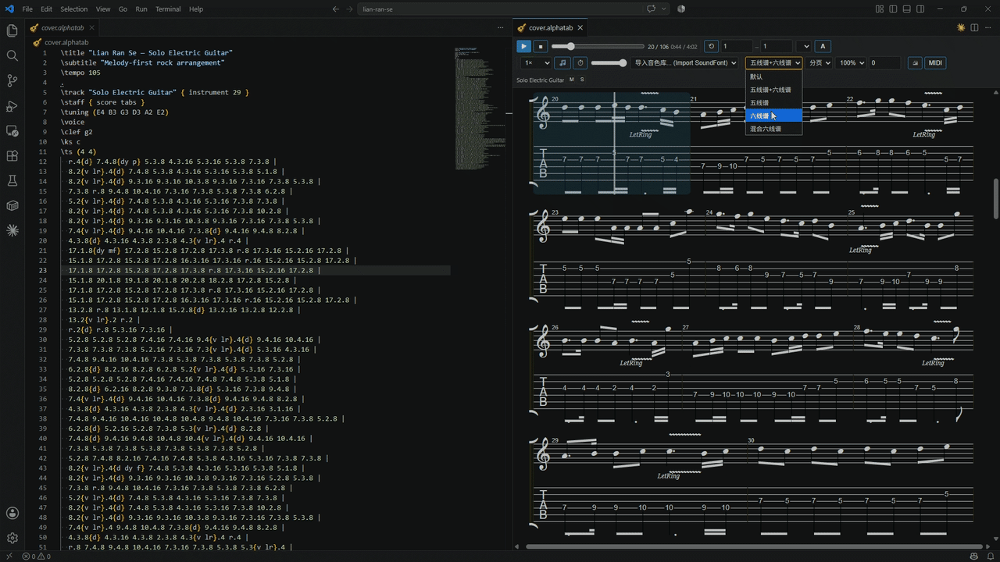

# VS Code AlphaTab (Enhanced Edition)


> A powerful guitar tab and score previewer for VS Code. This fork of [LSTM-Kirigaya/vscode-alphatab](https://github.com/LSTM-Kirigaya/vscode-alphatab) turns the preview into a fully working audition surface for arranging, featuring A/B compare, loop-a-phrase playback, and gate diagnostics directly in the Problems panel.
> *(It also fixes upstream issues where the extension fails inside modern VS Code with repeated `importScripts` NetworkErrors and a blank preview).*

## Features 🎸

**Preview & playback**
- Renders alphaTex, re-rendering as you type — without reloading the soundfont or losing your
  scroll and playback position.
- Transport: play/pause, stop, seek bar with bar and time readouts, playback speed, metronome,
  count-in, volume.
- **Loop a bar range** — the control you want when auditioning one phrase over and over.
- Zoom, page/horizontal layout, stave profile, display transpose, per-track mute/solo.
- Section navigator built from `\section` markers. Print and MIDI export.

**A/B compare**
- One panel holds both your arrangement and its reference score. `Alt+B` swaps between them,
  keeping the bar position and resuming playback where it left off.
- If a `sidecar.json` sits next to the files, its `tabBars`/`sourceBars` entries map bars between
  the two sides, so the swap lands on the corresponding bar even where they do not line up 1:1.

**Editing**
- Diagnostics in the Problems panel as you type, with precise positions, from alphaTab's own
  parser — a half-finished file still reports usefully instead of failing wholesale.
- Completions with documentation, hover on `\keywords` and on fret tokens
  (`5.3` → *G3 · string 3 (G) · fret 5*), snippets, outline and folding from `\section`.
- Click a note in the preview to jump the editor cursor there, and move the editor cursor to
  scroll the preview.

**Companion tools**
- Any CLI that takes a file and prints JSON can feed the Problems panel and a status-bar gate
  indicator. Ships with a preset for the
  [Piano-to-Guitar](#piano-to-guitar-workflow) toolchain.

## Demonstrations 🎥

### Jump to tab
Automatically jump to the alphaTab text for any note you select in the player.


### Change Speed
Easily adjust the playback speed to practice at your own pace.


### Change Tab Format
Seamlessly switch between different tab formats directly from the player interface.



### Export using Print Function
An example exported using the 'print' function.
[View the exported PDF](alphatab-print-example.pdf)

## Install 💻

**Option A — prebuilt VSIX:**

1. Download `alphatab-0.1.0.vsix` from this fork's
   [Releases page](https://github.com/starryark/vscode-alphatab/releases).
2. ```
   code --install-extension alphatab-0.1.0.vsix
   ```
   (or Extensions panel → `···` → *Install from VSIX...*)
3. Restart VS Code. If the upstream extension is installed, remove it first:
   `code --uninstall-extension kirigaya.alphatab`.

**Option B — build from source** (Node.js 18+):

```
git clone https://github.com/starryark/vscode-alphatab.git
cd vscode-alphatab
npm ci
npx --yes @vscode/vsce package        # produces alphatab-0.1.0.vsix (~2.4 MB)
code --install-extension alphatab-0.1.0.vsix
```

Then open a `.alphatab` file and click the preview button in the editor title bar.

### Soundfonts

Only a small general-purpose bank (1.3 MB) ships with the extension, which is why the package is
2.4 MB rather than the 137 MB it used to be. To use your own instrument banks, point
`alphatab.soundFonts` at them:

```jsonc
"alphatab.soundFonts": [
  "C:/soundfonts/Acoustic Guitars JNv2.4.sf2",
  "C:/soundfonts/Electric Guitars JNv4.4.sf2"
]
```

They stay on your disk and appear in the preview's soundfont picker.

## Keybindings

| Key | Action |
|---|---|
| `Alt+Space` | Play / pause |
| `Alt+B` | Swap A/B |
| `Alt+L` | Toggle loop |

## Piano-to-Guitar workflow

If the open file lives inside a [Piano-to-Guitar](https://github.com/) project (detected by
walking up for `tools/check.mjs` and `AGENTS.md`), the extension runs that project's gate on save
and reports the results inline:

- `validate.mjs` and `playability.mjs` always; `check.mjs` as well when a `sidecar.json` and a
  `source.json` digest are present.
- Findings land on the right bar in the Problems panel; the status bar shows the gate verdict.
- A `0/0` comparison row is flagged as a **vacuous** pass rather than shown as green, and
  `playability`'s exit code is ignored in favour of its `errors[]` — both are documented traps in
  that project.
- `alphatab.companion.snapOnSave` (off by default) runs `history.mjs snap` before each save,
  closing the one gap in that workflow's history: a hand edit made in the editor.

Set `alphatab.companion.transpose` per project if the arrangement sits above its source, and
`alphatab.companion.preset` to `none` to turn the integration off.

## The webview fixes

Kept here because each looks removable and each breaks the extension:

- **`importScripts` NetworkError / blank preview.** alphaTab renders and synthesizes in Web
  Workers, but workers in a VS Code webview cannot load the cross-origin `vscode-cdn.net` URL
  alphaTab auto-detects. Rendering moves to the main thread (`core.useWorkers: false`), and the
  bundle is fetched on the main thread and handed to the synthesizer worker as a same-origin
  `blob:` URL (`core.scriptFile`). Audio uses the ScriptProcessor path because AudioWorklet's
  `addModule()` hits the same wall.
- **Blank preview on open.** The extension waits for a `ready` handshake before sending content;
  messages posted before the webview attaches its listener are silently dropped.

See `CLAUDE.md` for the full list and for the two index-numbering traps in alphaTab's API.

---

Built on [AlphaTab](https://alphatab.net/). If you are new to alphaTex, the
[language tutorial](https://alphatab.net/docs/alphatex/introduction/) is the place to start.

Upstream project: [LSTM-Kirigaya/vscode-alphatab](https://github.com/LSTM-Kirigaya/vscode-alphatab).
